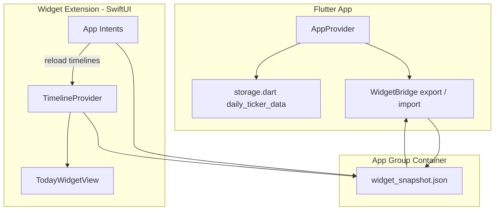
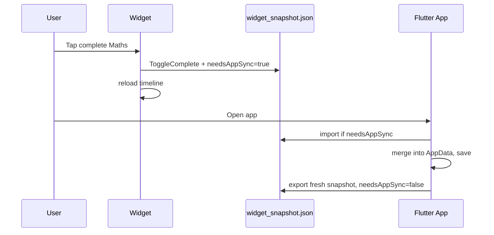

# iOS Home Screen Widget — Design (Daily Ticker)

**Platform:** iOS first (WidgetKit + App Intents)  
**Primary job:** Pick today’s missions and tick them complete **without opening the app**.  
**Secondary (optional):** Weather and Feel, controlled by widget configuration.

This mirrors the **Today** tab: mission picker → today’s list → star completion.

---

## Goals

| Priority | Capability |
|----------|------------|
| P0 | See today’s selected missions and progress (X/Y ⭐) |
| P0 | Tap to **complete / uncomplete** a mission (interactive widget) |
| P0 | Tap to **add / remove** missions on today’s list (interactive widget) |
| P1 | Optional **Weather** row (5 emoji choices) |
| P1 | Optional **Feel** row (5 emoji choices) |
| P2 | Tap widget header → open app on Today tab |
| P2 | Show active profile name/avatar + streak chip |

**Non-goals (v1):** Missions CRUD, Wins/Achievements, profile switching inside widget, iPad/macOS widgets.

## Decisions (locked in)

| Topic | Choice |
|-------|--------|
| **Profile** | Always **active profile** from the app — no profile picker in widget settings |
| **Mission picker** | **Inline chips** on Medium and Large (horizontal scroll) — no “open app to pick” unless chips cannot fit |
| **All done** | Show **“Super day! You earned all your stars! 🎉”** banner (same copy as Today) on every size when today’s list is complete |

---

## iOS constraints (drives the design)

1. **Home screen widgets are native SwiftUI** (WidgetKit), not Flutter UI.
2. **True tap-to-toggle on the widget** requires **iOS 17+** [interactive widgets](https://developer.apple.com/documentation/widgetkit/making-a-configurable-widget) via **App Intents** (`AppIntent`, `Button(intent:)`).
3. **Data** must live in an **App Group** container so the Runner app and widget extension read/write the same file.
4. Flutter’s `shared_preferences` does **not** share with the widget by default — we add a **widget snapshot** written on every save and merged on app resume.

**Minimum OS:** iOS 17.0 for interactive toggles; iOS 16 could ship a read-only “glance + open app” fallback later.

---

## Widget families

### 1. Small — `systemSmall` (“Quick star”)

**Use when:** One tap to finish the next mission.

```
┌─────────────────────┐
│ Daily Ticker    🔥3 │
│ Today  2/5 ⭐       │
│ ████░░░░░░          │
│                     │
│  ☐ 📖 English       │  ← tap = complete (if 1 left)
│  or Super day banner 🎉 │
└─────────────────────┘
```

- Shows progress + **first incomplete** mission, or **Super day** banner when all done (see [Celebration state](#celebration-state-all-done)).
- Single **ToggleCompleteIntent** on the row.
- No mission picker (space); tap empty area → `OpenTodayIntent`.

---

### 2. Medium — `systemMedium` (“Today list”) — **default**

**Use when:** Main daily driver on iPhone home screen — **picker + list in one place**.

```
┌──────────────────────────────────────────┐
│ 🦊 Alex · How's today?          🔥 3    │
│ 2/5 ⭐  ████████░░░░░░                   │
├──────────────────────────────────────────┤
│ Pick: [📖 Eng⭐][🔢 Maths][🎹 Piano]… →  │  ← horizontal scroll, inline chips
├──────────────────────────────────────────┤
│ ☑ 📖 English                             │
│ ☐ 🔢 Maths                               │
│ ☐ 🎹 Piano                               │
└──────────────────────────────────────────┘

When all done, list area becomes:
│ Super day! You earned all your stars! 🎉 │
```

- **Header:** active profile avatar + name (read-only), date optional, streak chip.
- **Inline chips row** (always when not in Super day state, or still shown above banner if space allows):
  - Horizontal `ScrollView` of mission chips; tap → `ToggleOnTodayIntent`.
  - Selected chip: mission color + ⭐ suffix (match app picker).
  - Unselected: full color pill; selected: slightly dimmed + ⭐.
  - Cap visible chips ~6; scroll for more. Icon-only fallback at largest Dynamic Type if needed.
- **Today rows:** up to **3** missions when chips shown; **4–5** if Style = Tasks only and chips collapsed to one line of icons. Truncate with “+N in app” only as last resort.
- Each row: `ToggleCompleteIntent(missionId)`.
- **No footer “Add mission” button** — chips replace it.

**Weather/Feel:** Off by default in Medium (config may hide one today row to fit a single emoji strip).

---

### 3. Large — `systemLarge` (“Full today”)

**Use when:** Kid does everything from the home screen.

```
┌──────────────────────────────────────────┐
│ Profile · How's today? · 2/5 ⭐   🔥 3   │
├──────────────────────────────────────────┤
│ [optional] Weather: ☀️ ⛅ ☁️ 🌧️ ⛈️      │
│ [optional] Feel:    😊 😐 😴 😤 🤩      │
├──────────────────────────────────────────┤
│ Pick missions (chips, scroll):           │
│  📖 English ⭐  🔢 Maths  🎹 Piano …     │  ← ToggleOnTodayIntent
├──────────────────────────────────────────┤
│ Today's list:                            │
│  ☑ 📖 English                            │
│  ☐ 🔢 Maths                               │
│  ☐ 🎹 Piano                               │
└──────────────────────────────────────────┘
```

- Same **inline chips** row as Medium (more vertical room).
- **Optional blocks** controlled by widget configuration (see below).
- **Super day** banner replaces today list when complete (chips may remain above for adding tomorrow’s missions — optional v1: hide chips during celebration to reduce clutter).

---

## Celebration state (all done)

When `today.length > 0` and every item has `completed: true`:

- Replace the **today list** (and on Small, the single mission row) with a compact gradient banner:
  - **Copy:** `Super day! You earned all your stars! 🎉` (same as `today_view.dart`).
  - **Style:** yellow → pink gradient, white bold text, rounded corners (match in-app celebration).
- Keep header (profile, X/X ⭐, full progress bar at 100%, streak).
- **Small:** banner only (no chips).
- **Medium / Large:** banner in list slot; chips row can stay for quick edits or be hidden in v1 if tight.

Reload timeline immediately after last `ToggleCompleteIntent` flips the final star.

---

## Widget configuration (long-press → Edit Widget)

| Setting | Values | Default |
|---------|--------|---------|
| **Style** | Tasks only · Tasks + Weather · Full (Weather + Feel) | Tasks only |
| **Show streak** | On / Off | On |

**Not configurable:** profile (always active profile from app).

Stored in `WidgetConfiguration` / `IntentConfiguration` — no App Group needed.

---

## Interaction model (App Intents)

| Intent | Action | Updates |
|--------|--------|---------|
| `ToggleCompleteIntent` | Flip `dailyMissions[].completed` for today | `widget_snapshot.json` + `needsAppSync=true` |
| `ToggleOnTodayIntent` | Add/remove mission from today’s list | same |
| `SetWeatherIntent` | Set `dailyEntries.weather` for today | same |
| `SetMoodIntent` | Set `dailyEntries.mood` for today | same |
| `OpenTodayIntent` | `dailyticker://today` | — |

Each intent:

1. Reads `widget_snapshot.json` from App Group.
2. Applies the same rules as `AppProvider` (`toggleMissionOnToday`, `toggleMissionComplete`, `setWeather`, `setMood`).
3. Writes snapshot back, sets `needsAppSync: true`, calls `WidgetCenter.shared.reloadAllTimelines()`.

**Flutter app on resume** (`WidgetsBindingObserver.didChangeAppLifecycleState` → resumed):

1. If `needsAppSync`, load snapshot, merge into `AppData`, `saveAppData()`, clear flag, push fresh snapshot.

This keeps **one source of truth** in the app while allowing offline widget edits.

---

## Shared data: `widget_snapshot.json`

App Group ID (example): `group.com.dailyticker.shared`

```json
{
  "version": 1,
  "updatedAt": "2026-05-24T12:00:00Z",
  "needsAppSync": false,
  "activeProfileId": "uuid",
  "dateKey": "2026-05-24",
  "profile": { "id": "...", "name": "Alex", "avatar": "🦊" },
  "streak": 3,
  "entry": { "weather": "sunny", "mood": "happy" },
  "missions": [
    { "id": "m1", "name": "English", "icon": "📖", "color": "#4ECDC4", "sortOrder": 0 }
  ],
  "today": [
    { "missionId": "m1", "completed": true },
    { "missionId": "m2", "completed": false }
  ]
}
```

- **`missions`:** all missions for active profile (for picker chips).
- **`today`:** only missions selected for `dateKey` (ordered like app).
- Omit `entry.weather` / `entry.mood` when unset.

**Flutter:** `WidgetBridge.exportSnapshot(AppData data)` after every `saveAppData`.  
**Native:** timeline provider decodes this JSON only (no Flutter engine).

---

## Architecture





---

## Visual design notes

- Reuse app **kawaii** feel: rounded card, purple headings, mission colors as chip/row accents.
- **Checkbox:** empty circle → filled gold star when complete (match Today row).
- **Progress bar:** purple track, orange fill (same as Today).
- **Widget background:** `containerBackground` gradient (soft purple → cream) for iOS 17+.
- **Dynamic Type:** support accessibility sizes; Medium may drop to 3 rows at largest sizes.

---

## Flutter integration checklist (implementation phase)

1. **Xcode**
   - Add target: `TodayWidgetExtension`
   - Enable App Group on Runner + Extension
   - Embed extension in Runner

2. **Dependencies (optional helpers)**
   - `home_widget` — timeline reload + URL launch from Flutter
   - Or minimal custom platform channel + manual App Group file I/O

3. **Dart**
   - `lib/widget/widget_bridge.dart` — export/import snapshot
   - Hook `AppProvider._update()` → `WidgetBridge.export`
   - `main.dart` lifecycle → `WidgetBridge.importIfNeeded()`
   - Deep link: `dailyticker://today`

4. **Swift**
   - `WidgetSnapshot` Codable models
   - `TodayWidget` + `TodayWidgetProvider`
   - App Intents (one file per intent or grouped)
   - Unit tests for JSON merge logic (Swift)

5. **Info.plist**
   - URL scheme `dailyticker` for fallback navigation

---

## Edge cases

| Case | Behavior |
|------|----------|
| No active profile | Widget shows “Open Daily Ticker to set up” |
| No missions | “Add missions in the app” + link |
| Today list empty | Show picker chips only (Large) or “+ Add mission” (Medium) |
| Mission deleted but still in `today` | Hide row; prune on next app sync |
| Midnight rollover | `dateKey` in snapshot stale until reload; timeline policy `.atEnd` + refresh at midnight |
| Multiple devices | Same as today — last write wins (acceptable for v1) |

---

## Phased delivery

| Phase | Deliverable |
|-------|-------------|
| **1** | App Group + `widget_snapshot.json` + Flutter export/import |
| **2** | Medium widget, read-only + open app |
| **3** | App Intents: toggle complete + toggle on today |
| **4** | Large widget + mission picker chips |
| **5** | Configurable Weather / Feel + Small widget |
| **6** | Lock Screen accessories (optional): circular progress, streak |

---

## Open questions (for you)

1. **Profile:** Widget always uses **active profile** only, or allow picking profile in widget settings?
2. **Picker on Medium:** Inline chips (crowded) vs. button that opens app — preference?
3. **Celebration:** Show “Super day! 🎉” on widget when all complete (Small/Medium)?

---

## Related app code

| Concept | Location |
|---------|----------|
| Today UI | `lib/screens/today_view.dart` |
| Toggle select / complete | `lib/providers/app_provider.dart` |
| Persistence | `lib/data/storage.dart` (`daily_ticker_data`) |
| Weather / Feel options | `lib/models/types.dart` (`weatherOptions`, `moodOptions`) |
